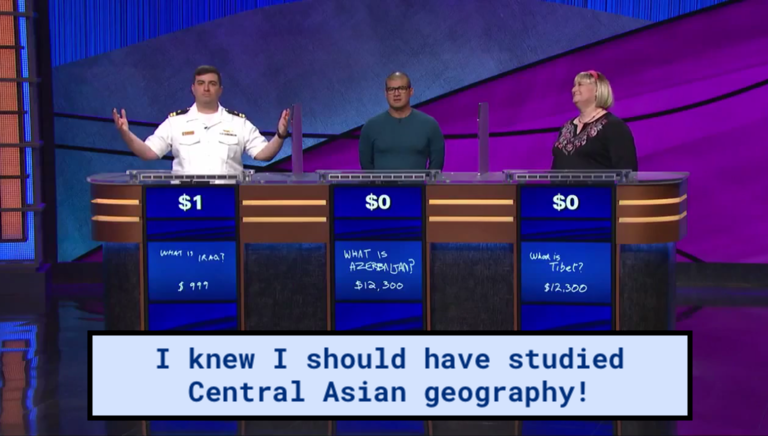
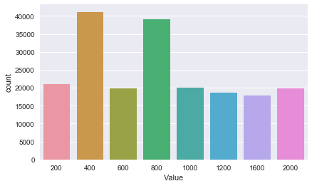
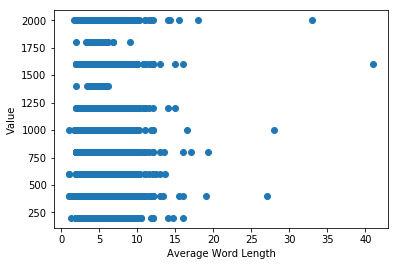
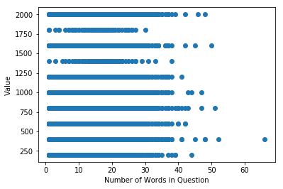
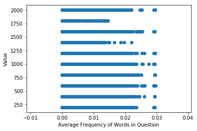
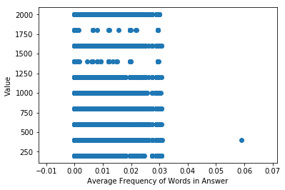
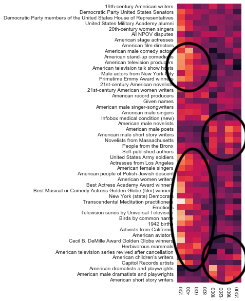
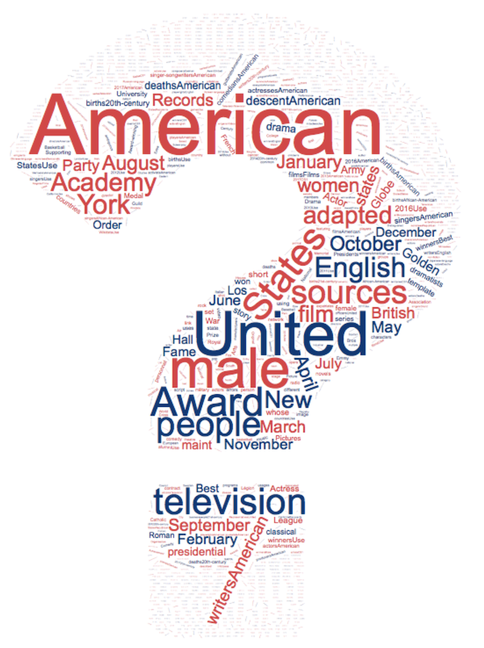

# Trivial Pursuit: *Jeopardy!* Questions and the Value of Knowledge

The goal of this project is to predict the dollar value of *Jeopardy!* Questions. This might seem like a trivial endeavor (pun *totally* intended). However, this analysis could tell us a lot about:

> What kind of knowledge do we (or at least the writers of *Jeopardy!*) value in Western society?

> What is considered common knowledge, and what is considered more difficult?

In addition, this project could be extended to any test for which the questions are ordered or assigned points by difficulty, such as standardized tests, giving students a sense of where to prioritize study efforts.



## The Dataset

* approximately 217,000 *Jeopardy!* questions from 1984 to 2012
* includes the question, answer, value, category, round, show number, and air date
* values doubled in November, 2001
* Double Jeopardy and Daily Doubles
* distribution of target values:

  
<br><br>

Fun facts:

```
China is the most common answer in Jeopardy!
```
<!--
### Data Cleaning

* *Jeopardy!* questions doubled in value in November 2001, so I doubled all values before that time
* I excluded Daily Double and Final Jeopardy questions, for which the value is determined by the contestant (though this was not always straightforward)
* Typical NLP tasks: lowercase, remove punctuation, lemmatization, tokenization

More fun facts:

-->

* the most common words in the *questions* are:

```
one        241
first      188
name       173
u          121
2          117
city       111 <--
country    106 <--
called      98
state       91 <--
like        91
```

* the most common words in the *categories* are:

```
words       80
history     73 <--
world       61 <--
tv          47 <--
century     46
time        45
american    45 <--
science     40
us          39
movie       37 <--
```

* most common bigrams in questions:

```
[(('New', 'York'), 309), <--
(('became', 'first'), 277), <--
(('The', 'first'), 248), <--
(('This', 'country'), 246), <--
(('The', 'name'), 241),
(('&', 'The'), 194),
(('capital', 'city'), 160), <--
(('This', 'state'), 151), <--
(('No.', '1'), 144),
(('country', 'In'), 134)]
```

<!--
 * most common trigrams in questions:

```
[(('South', 'American', 'country'), 61), <--
(('New', 'York', 'City'), 59), <--
(('World', 'War', 'II'), 39), <--
(('whose', 'name', 'means'), 38),
(('became', 'first', 'woman'), 28), <--
(('feet', 'sea', 'level'), 24),
(('British', 'prime', 'minister'), 23),
```
-->

Without modeling, we already know that these are important to know:

* Countries/states and their capitals
* "Firsts"
* TV and movies
* History
* New York

## Feature Generation

There is not a lot we can do with the data directly:

* number of words in question
* average length of words in question
* frequency in English of words in question or answer






These were not predictive, not even a little...

* linear regression root mean squared error: `577`
* average prediction: `935`

### Topic Modeling

* unsupervised methodology
* can uncover non-obvious clusters of knowledge
* number of topics chosen a priori 
<!--, but could use grid search on predictive accuracy and other methods-->
* but results are unlabeled, reducing interpretability:

```
ACADEMIA?
['state','university','son','college','spanish','sea']

NEW YORKERS?
['new','city','company','york','president']

WHERE PEOPLE ARE FROM?
['here','continent','composer','region','north']

MUSIC?
['song','element','paul','prime']

U.S. HISTORY?
['nation','border','painting','still','Virginia','stand']

WORLD WAR II?
['during','war','died','world','war','ii','father']

...
```

### Wikipedia-Derived Categories

<!--
However, answers themselves could in theory be categorized without topic modeling. For example:

```
Emily Dickinson: poets
Albert Einstein: scientists
The Blues Brothers: movies
```
--> 

I built an interface to the Wikipedia and Google Custom Search APIs to get the categories associated with Wikipedia articles:

<!--categories are basically collections of related Wikipedia articles-->

**Moses**:

```
'15th-century BC biblical rulers',
'Adoptees',
'Ancient Egyptian Jews',
'Ancient Egyptian princes',
'Angelic visionaries',
'Biblical murderers',
'Book of Exodus',
'Christian royal saints',
'Christian saints from the Old Testament',
'Founders of religions',
'Wonderworkers'
...but also...
'Articles flagged for missing citations'
'Articles with unsourced statements from June 2017'
```
<!--
However:

* what if answer is not a Wikipedia article:

```
"F-A-N-T-A-S-T-I-K" (cleaner from SC Johnson)
"the ant" vs "Ant"
```

* tried to build fuzzy match algorithm --- did not do well
* built function to query google custom search API to search Wikipedia for answer --- did really well!
* dropped categories that appeared in less than 25 observations and more than 500 of total rows
* dropped non-meaningful categories
* but feature generation is slow and dependent upon connectivity/API responsiveness...up to about 10,000 rows so far
-->

## Exploring the World of *Jeopardy!*

* most common categories overall:

```
Category:English-language films 
Category:Grammy Award winners 
Category:American male film actors 
Category:American film actresses 
Category:Presidential Medal of Freedom recipients 
Category:Member states of the United Nations 
```

  

Notice anything interesting?

  
<sub><b>Figure: </b> Heatmap of Select Categories: TV versus Poets </sub>

<!--
* most common categories for values of \$500 or less:

```
Category:American male film actors 547
Category:States of the United States 979
Category:Hall of Fame for Great Americans inductees 559
Category:Presidents of the United States 628
Category:Presidential Medal of Freedom recipients 697
Category:Member states of the United Nations 1558
Category:20th-century American politicians 590
Category:Prophets of Islam 646
Category:American films 929
Category:American television personalities 551
Category:English rock singers 690
Category:Male television writers 584
Category:Princeton University alumni 523
Category:Free speech activists 515
Category:Countries in Europe 593
```

  
<sub><b>Figure: </b> Word Cloud of Questions Under 500 Dollars </sub>
<br><br>
<br><br>

* most common categories for values of \$1,500 or more:

```
Category:States of the United States 396
Category:19th-century American politicians 203
Category:Hall of Fame for Great Americans inductees 240
Category:Presidents of the United States 297
Category:Presidential Medal of Freedom recipients 249
Category:Member states of the Organisation of Islamic Cooperation 224
Category:Member states of the Union for the Mediterranean 359
Category:Member states of the United Nations 1067
Category:20th-century American politicians 211
Category:New York (state) lawyers 310
Category:American films 329
Category:Countries in the Caribbean 408
Category:American television personalities 229
Category:English rock singers 324
Category:English male dramatists and playwrights 231
Category:Male television writers 253
Category:Princeton University alumni 287
Category:Free speech activists 285
Category:Countries in Europe 375
Category:G20 nations 268
Category:American billionaires 241
Category:Progressive Era in the United States 201
```

  
<sub><b>Figure: </b> Word Cloud of Questions Over 1,500 Dollars </sub>
<br><br>
<br><br>

* most common categories by year

* topic modeling of dataset
-->

## Random Forests

<!--high feature space-->

### Regression

Random forest regression not successful on limited feature set:
~400 features
~50,000 observations (split 75/25)

Accuracy: 15.6% at best

### Classification

* Let's ask an easier question...can I predict if a question will be of high value (\$1,200 or greater)?

~400 features
~50,000 observations (split 75/25)

Accuracy: 67%
Precision: 53%
Recall: 15%

Most Important Features:

```
G20 nations, Importance: 0.02
20th-century male writers, Importance: 0.02
```

Predicted |	0|	    1
Actual	||	
-----------+-------+----
0	       | 8370|	584
1       |	3814|	670


## Next Steps

* super categories
* grid search
* hyperparameters
* build out all categories/features
* other models
* predict on unsupervised topic models
